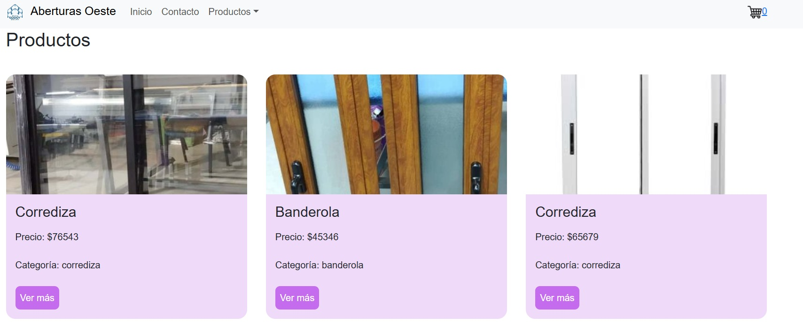
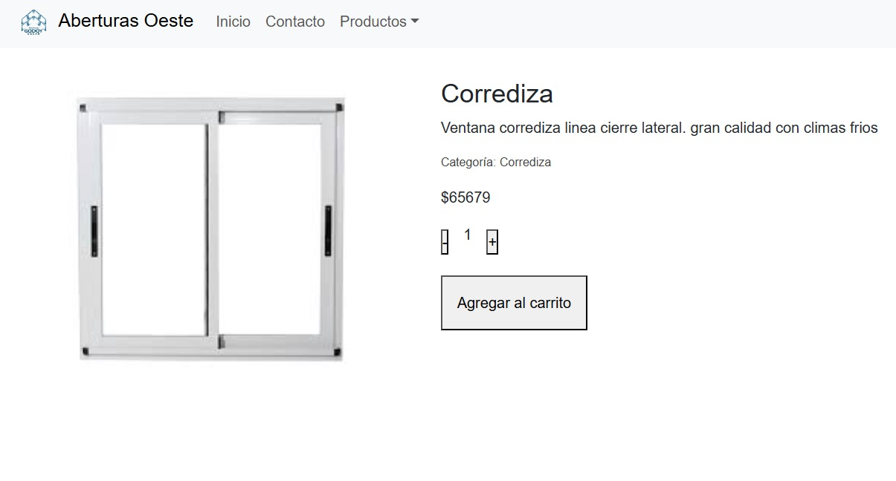

# Curso CoderHouse - Reacts JS 
## Proyecto Final - Aberturas Oeste

Este es un proyecto para el curso de CoderHouse, que se trata de un **e commerce** de una fabrica de aberturas de la zona oeste de Buenos Aires.

## Detalle
Donde cada producto tiene su propia ventana con sus características

### Esteban Pederiva